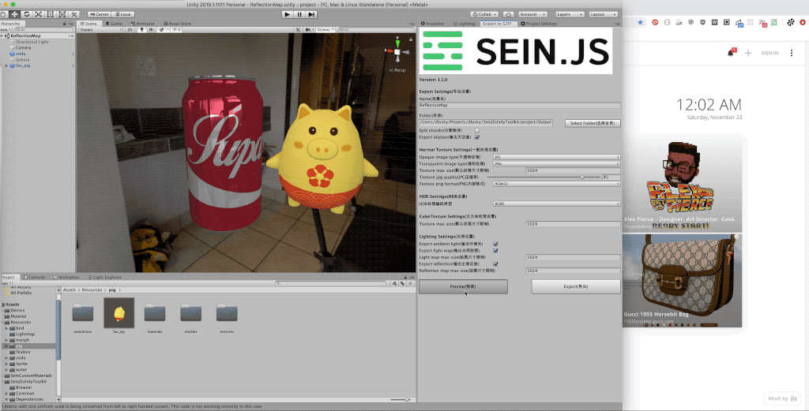

<h3 align="center">Modern web game engine</h3>

Homepage: <a href="http://seinjs.com" target="_blank">seinjs.com</a>

### Workflow

### Development

  * `cd Hilo3d` and run `npm i`.
  * Switch to root folder and run `npm i`.
  * run `npm run dev` to dev.
  * run `npm run build` release the code.
  * run `npm run demo-build` to build demo.

### Authors

 * [dtysky](https://github.com/dtysky)
 * [hiloteam](https://github.com/hiloteam)

### Contact us
  * QQ Group: 180165546

### License

[MIT License](http://en.wikipedia.org/wiki/MIT_License)
